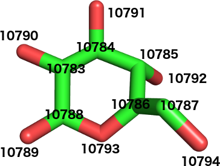
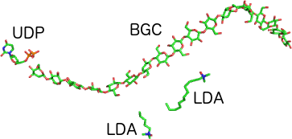

# Types of Data Files

## General Classification

- **PDB:** 
  - standard textual file describing the three-dimensional structure of molecules 
  - They are used to represent atom connectivity
- **DCD:** are typically large binary files that contain the time varying atomic coordinates for the system. Each set of coordinates correspond to one frame in time. 
- **PSF:** contains all of the molecule-specific information needed to apply a particular force field to a molecular system. The PSF file contains six main sections of interest
  - atoms
  - bonds 
  - angles
  - dihedrals
  - impropers (dihedral force term used to maintain planarity)
  - cross-terms

- **Topology Files:** Contains all of the information needed to convert a list of residue names into a complete PSF structure file.

## PDB Files

- Popular PDB archives
  - [wwPDB](https://www.wwpdb.org/)
  - [RCSB](https://www.rcsb.org/)

-  In 2014, PDB developers stopped modifying and extending the PDB format.
-  Because the PDB format uses column position to delineate fields, one of its major limitations is that it does not allow for the description of structures containing more than 99,999 atoms.
-  This is because only 5 column positions are reserved for an atom's serial number.
-  Similarly, since only one column can describe a chain ID, no structure in PDB format can have more than 62 chains (allowed characters are: a-z, A-Z, and 0-9).
-  There is a new standard format for structures in the PDB archive: PDBx/mmCIF, or simply mmCIF

The following examples use 2hac protein. Wikipedia has a good documentation on [protein structures](https://en.wikipedia.org/wiki/Protein_primary_structure). If you need to understand what is primary structure, secondary structure etc. 

```s
$ grep ATOM 2hac.pdb | tail
ATOM   1080  O   ASP B  30   15.852   9.308  20.637  1.00  0.00 O
ATOM   1081  CB  ASP B  30   14.621   8.686  18.383  1.00  0.00 C
ATOM   1082  CG  ASP B  30   14.115   8.214  17.018  1.00  0.00 C
ATOM   1083  OD1 ASP B  30   14.307   8.938  16.054  1.00  0.00 O
ATOM   1084  OD2 ASP B  30   13.543   7.138  16.960  1.00  0.00 O
ATOM   1085  OXT ASP B  30   17.814   9.632  19.808  1.00  0.00 O
ATOM   1086  H   ASP B  30   17.125   6.964  18.700  1.00  0.00 H
ATOM   1087  HA  ASP B  30   16.405   9.587  17.597  1.00  0.00 H
ATOM   1088  HB2 ASP B  30   14.359   7.957  19.136  1.00  0.00 H
ATOM   1089  HB3 ASP B  30   14.164   9.634  18.625  1.00  0.00 H
```
- It consist of following sections
  - Title Section : General details about molecules in the file
  -  

### Title Section

- Header Record (HEADER)
  ```s
  HEADER    MEMBRANE PROTEIN                        12-JUN-06   2HAC
  ```
   the structure in this file is a membrane protein; it was deposited on the 12th of June, 2006; and its PDB ID is 2HAC. the first six characters are the record's name ("HEADER"), characters 11-50 are reserved for the "classification" field (membrane protein), characters 51-59 are used for the deposition date, and characters 63-66 hold the structure's ID.

- Compound Record (COMPND)
  ```s
    COMPND    MOL_ID: 1;
    COMPND   2 MOLECULE: T-CELL SURFACE GLYCOPROTEIN CD3 ZETA CHAIN;
    COMPND   3 CHAIN: A, B;
    COMPND   4 FRAGMENT: TRANSMEMBRANE REGION (28-60);
    COMPND   5 SYNONYM: T-CELL RECEPTOR T3 ZETA CHAIN;
    COMPND   6 ENGINEERED: YES
  ```
     Each line consists of a token/value pair

     Multi-line records use numbers to allow continuation of a single record. So, for example, the line beginning with "COMPND   2" simply continues the compound record, by giving another token/value pair. In this case, the token (or key) is MOLECULE and the value is T-CELL SURFACE GLYCOPROTEIN CD3 ZETA CHAIN.

- Remark Record (REMARK)
  A PDB remark is similar to comments in Python or other languages. 
  In PDB files, a remark starts with REMARK and a number, which simply identifies the remark. So, for example, remark #3 starts like this:
  ```s
  REMARK   3
    REMARK   3 REFINEMENT.
    REMARK   3   PROGRAM     : XPLOR-NIH 2.11
    REMARK   3   AUTHORS     : CHARLES SCHWIETERS
    [etc.]
  ```

### Primary Structure Section

- The primary structure section lists, among other things, the amino-acid sequence of the protein. The main record type for doing this is the **SEQRES**

```s
SEQRES   1 A   33  ASP SER LYS LEU CYS TYR LEU LEU ASP GLY ILE LEU PHE
SEQRES   2 A   33  ILE TYR GLY VAL ILE LEU THR ALA LEU PHE LEU ARG VAL
SEQRES   3 A   33  LYS PHE SER ARG SER ALA ASP
SEQRES   1 B   33  ASP SER LYS LEU CYS TYR LEU LEU ASP GLY ILE LEU PHE
SEQRES   2 B   33  ILE TYR GLY VAL ILE LEU THR ALA LEU PHE LEU ARG VAL
SEQRES   3 B   33  LYS PHE SER ARG SER ALA ASP
```
- 1, 2, ... is serial number

- A, B, ... is Chain ID
- 33, 33, ... is number of residues in a chain from N- to C-terminus (i.e., from amino to carboxy terminus)
  
### Secondary Structure Section

- Gives info about secondary structure of proteins (helices and sheets)
- The secondary structures are determined by various algorithms used by the authors or wwPDB. Note that these algorithms do not always agree, so it is possible for different databases to give conflicting information about secondary structure

### Connectivity Annotation Section

This section gives information about the bonds or linkages present in the protein structure, but which is not given in the primary structure. 
Eg: a disulfide bond, specified with the SSBOND record

```s
SSBOND   1 CYS A    2    CYS B    2                          1555   1555  2.02 
```

- CYS : Short of residue name (Cysteine)
- A, B, ... are chain IDs
- 2, ... residue number within the chain
- 1555 1555 is symmetry operators
- 2.02 length of disulfide bond

The below records LINK and CONECT are mostly used for Heterogens. It is discussed later.

The LINK record specifies an inter-residue connection(connection between residues #912 and #913 in below example) 
```s
LINK         O4  BGC A 912                 C1  BGC A 913     1555   1555  1.42
```
- A : Chain
- BGC : residue in chain A
- O4 : atom in BGC #912
- C1 : atom in BGC #913
- 1.42 : Bond distance between two atoms

The connection within a residue is denoted by CONECT record:
```s
CONECT 6748 8743
```
This example simply links two atoms (#6748 and #8743). Below is a more complicated example:

```s
CONECT10783107841078810790
```

Again, this very compact format is due to using column numbers to delinate fields, instead of using a field separator character (like a comma or space). This is what the above record would like with spaces between each field:

```s
CONECT 10783 10784 10788 10790
```
To understand what's going on in this record, compare it with the following image (click for a larger version):



In the above BGC residue, each atom is labeled by its serial number. Now we can see that atom 10783 is connected to 10784, 10788, and 10790.

### Crystallographic and Coordinates Section

- Information about crystal structure the atom coordinates are based on (CRYST1, ORIGXn, SCALEn)
- The CRYST1 record describes the shape of the unit cell
```s
CRYST1    1.000    1.000    1.000  90.00  90.00  90.00 P 1           1
````
- This is simple quibic unit cell 
- 1.000 1.000 1.000 ... unit cell edge length is 1 Amstong
- 90.00 90.00 90.00 ... means all angles are 90 degree
- P 1 ... is space group


- When a protein structure is first submitted to the PDB archive, it is given in coordinates that may be different from those used in the PDB file. The original coordinates are called the submitted coordinates, and the coordinates used in the PDB file are called orthogonal coordinates. The ORIGXn records give the transformation matrix necessary to obtain the submitted coordinates from the orthogonal coordinates.

```s
ORIGX1      1.000000  0.000000  0.000000        0.00000
ORIGX2      0.000000  1.000000  0.000000        0.00000
ORIGX3      0.000000  0.000000  1.000000        0.00000
```

- "n" in ORIGXn is nth row of transformation matrix
- SCALEn gives transformation matrix needed to go from orthogonal coordinates to fractional coordinates, which are a fraction of the unit cell's length

```s
SCALE1      1.000000  0.000000  0.000000        0.00000
SCALE2      0.000000  1.000000  0.000000        0.00000
SCALE3      0.000000  0.000000  1.000000        0.00000
```
### Coordinate Section

- This is largest section
- Contains coordinates of every atom
- Model Record
  - Different protein conformations are represented with different models
```s
MODEL        [model_num]
ATOM      1  [...]
ATOM      2  [...]
ATOM      3  [...]
[...]
ENDMDL
```
  -   Atom Record: A single line that occurs multiple times for each atom record
  ```s
  ATOM      2  CA  ASP A  -3     -24.877   1.931  -4.644  1.00  0.00           C
  ```
  -  CA ... is atom name
  -  ASP ... is residue name
  -  A is chain ID
  -  -3 is residue ID
  -  -24.877 1.931 -4.644 ...orthogonal coordinates of the atom
  -  1.00 ... occupancy (proportion of time atom spends occupying a particular position in case of flexible molecules). If all atoms take only one conformation, so their occupancy is 100%(1.00)
  -  0.00 ... temperature factor(B-factor)
    -  C ... elemental symbol on periodic table
  - A **TER record** is given after all atoms of a chain are listed 
```s
ATOM    543  HB2 ASP A  30      13.952  -5.133 -14.399  1.00  0.00           H
ATOM    544  HB3 ASP A  30      13.434  -6.033 -12.973  1.00  0.00           H
TER     545      ASP A  30
ATOM    546  N   ASP B  -3     -24.040  -6.834   4.973  1.00  0.00           N
ATOM    547  CA  ASP B  -3     -24.918  -6.297   3.894  1.00  0.00           C
``` 
  - The TER record indicates the name of the last residue and chain for the atom that was just given

### Bookkeeping Section

- There are two records at the end of a PDB file: **MASTER** and **END**

```s
MASTER      124    0    0    2    0    0    0    616320   30    2    6
```
- In the above example, we can see that there are 124 REMARK records and 16320 atomic coordinate records. At first, it appears to say there are 616320 atoms, but this is because there are only 5 characters reserved for the field indicating the number of atoms. The initial "6" refers to the number of coordinate transformation records
- The final record is simply **END**

### Hetrogen Section

Heterogens are "non-standard" residues
```s
HET    BGC  A 901      12
```
- This record tells us that heterogen #901 is named BGC, is part of chain A, and has 12 corresponding HETATM records. 
- A few lines later, a HETNAM record tells us the full name of BGC
```s
HETNAM     BGC BETA-D-GLUCOSE
```
- HETATM records are analogous to ATOM records, except that they give information about chemicals that aren't standard amino acids or nucleotides. For example, both water and modified amino acids are considered heterogens.
- Below is the first heterogen atom entry:
```s
HETATM10783  C2  BGC A 901      11.313  82.102 123.399  1.00195.30           C 
```
The image below shows all heterogens present in **4HG6**:



- BGC : $\beta$ -D-Glucose (the fig has multiple ones liked together)
- UDP : uridine diphosphate
- LDA : lauryl dimethylamine-n-oxide

Further Hetrogens use LINK and CONECT records discussed earlier

## PDBx/mmCIF Files

- To overcome limitations of PDB now we have new standard format for structures in the PDB archive: PDBx/mmCIF, or simply mmCIF, which stands for "Macromolecular CIF".

- The name derives from the Crystallographic Information File (CIF) format, which describes small molecules.

## PSF Files

- A PSF file, also called a protein structure file, contains all of the molecule-specific information needed to apply a particular force field to a molecular system. The CHARMM force field is divided into a topology file, which is needed to generate the PSF file, and a parameter file, which supplies specific numerical values for the generic CHARMM potential function.
- PSF files may be in either CHARMM or X-PLOR format, with the CHARMM format using an integer rather than a name for the atom type.

- PSF files are required because :
  -  in PDB the bonds between most atoms are not explicitly defined. 

  - A PDB file only describes bond between heterogen atoms explicitly (LINK and CONECT records)

  -  Bonds between residues are implicitly present given (SEQRES records for primary protein structure, SSBOND etc. for secondary protein structure)
  -  **CHARMM Topology** can be read by:
      -  CHARMM
      -  NAMD
      -  OpenMM
      -  GENESIS
  - The following programs cannot read **CHARMM Topology** :
    - GROMACS
    - LAMMPS
    - Desmond
    - AMBER
- So we use a PSF file and move all connectivity information into that. 
  - PDB : now describes coordinates
  - PDF : describes connectivity
- Combining PDB and PSF we can recreate topology in another format. 
- A PSF File Should not be modified directly

### CHARMM PSF
  - A PSF file created and used internally by CHARMM and other programs.
  - The default CHARMM PSF is same as XPLOR 
  ```s
  PSF EXT CMAP CHEQ XPLOR

          3 !NTITLE
  * GENERATED BY CHARMM-GUI (HTTP://WWW.CHARMM-GUI.ORG) V1.8 ON JUN, 19. 2017. JOB
  * READ PDB, MANIPULATE STRUCTURE IF NEEDED, AND GENERATE TOPOLOGY FILE          
  *  DATE:     6/19/17     13:48:15      CREATED BY USER: apache                  

  1094 !NATOM
      1 PROA  -3  ASP  N  NH3  -0.300000  14.0070  0  0.00000  -0.301140E-02
  ```
  - The first line gives optional PSF file features supported by the present PSF file.
  - Default CHARMM format is same as XPLOR
  - EXT is "extended format" allow longer atom names
  - CMAP is dihedral cross-term corrections
  - CHEQ is an optional which is not usually important
  - 3 !NTITLE means title section is 3 lines long
  - The lines starting with * are title lines
  - The atom selection looks like this:

| Atom ID 	| Segment ID 	| Residue ID 	| Res. Name 	| Atom Name 	| Atom Type 	| Charge 	|  Mass  	|
|:-------:	|:----------:	|:----------:	|:---------:	|:---------:	|:---------:	|:------:	|:------:	|
|    1    	|    PROA    	|     -3     	|    ASP    	|     N     	|    NH3    	|  -0.30 	| 14.007 	|
|    2    	|    PROA    	|     -3     	|    ASP    	|    HT1    	|     HC    	|  0.33  	| 1.0080 	|
|         	|            	|            	|           	|           	|           	|        	|        	|
  - 1094 !NATOM means there are 1094 lines in the atom list that follows
  - The value after mass column is a boolean indicating whether the atom position is constrained(fixed) or not. 
  - The last two columns are Drude particle force field settings. They correspond to the atomic polarizability and atomic Thole scale factor, respectively. 
  - The next section contains a list of all bonds between the various atoms.
  ```s
  1102 !NBOND: bonds
   2    1     3     1    4    1     7    5
  10    7    12    10    1    5    13    5
[...]
  ```
-  Bonds are listed four-pairs per line. Each pair specifies the atom numbers involved in the bond. For example, the first bond is between atoms 2 and 1, the second bond is between atoms 3 and 1, the third is between 4 and 1, and so on
-  The angle section contains a list of all bonded atoms that form an angle:

```s
1994 !NTHETA: angles
  2    1    3    2    1    4    2    1    5
  3    1    4    3    1    5    4    1    5
[...]
```
- Atoms are listed in groups of 3, with up to 3 groups (or 9 atoms) per line. The first angle contains atoms 2, 1, and 3; the second group contains atoms 2, 1, and 4; and so on. Essentially, what this means is that atom 1 is connected both to atom 2 and atom 3, and that together, the three atoms form an angle. 
- It does not say what the actual value for the angle is. To calculate that, you need to know the coordinates of each atom, and that information is in the CRD or PDB files, not the PSF files.
- Similar to the angles section, this section lists every set of 4 connected atoms that form a dihedral angle. It looks like this:
```s
2904 !NPHI: dihedrals
    1    5    7     8    1    5     7     9
    1    5    7    10    1    5    13    14
[...]
```
- In this case, two sets of dihedral angles are given per line.
-  In the above example, atoms 1, 5, 7, and 8 form one dihedral angle, and atom 1 is connected to atom 5, atom 5 to atom 7, and atom 7 to atom 8. In other words, each atom that forms a dihedral angle is connected to the next atom in that angle's sequence
-  This is important as a distinction between regular dihedral angles and improper dihedral angles
-  An improper dihedral angle is a set of four atoms where three of the given atoms are connected to the other "central" atom
```s
148 !NIMPHI: impropers
    13     5    15    14    10     7    12    11
    15    13    17    16    24    17    26    25
[...]
```
-  In each improper dihedral angle, the first atom in the set is the central atom that the other three are attached to. So, for example, atom 13 is connected to atoms 5, 15, and 14; atom 10 is connected to 7, 12, and 11; and so on.

#### Donors Section

- The donors section lists 4 pairs of atoms per line, where each pair represents a hydrogen-bond donor defined in CHARMM topology files. Specifically, the first atom in the pair is the heavy atom to which a hydrogen is covalently bonded, and the second atom is the actual hydrogen atom. The first couple of lines in this section looks like this.
```s
116 !NDON: donors
    1     2     1     3     1     4    15    16
[...]
```
- The first line says that 116 donors follow. The second line says that atoms 1 and 2, together, form a hydrogen-bond donor group. If we look back to the atom section, we'll see that atom 1 is a nitrogen atom, and atom 2 is a hydrogen atom. The next two pairs given (1,3 and 1,4) involve the same nitrogen atom and two other hydrogen atoms. In other words, this nitrogen atom donates three hydrogen atoms.
- It is possible that a hydrogen atom might not be explicitly included in the file, in which case the second atom in the pair would be listed as "0".

#### Acceptors Section

- Like the donors section, the acceptors section lists four pairs of atoms per line. In this case, the two atoms in the pair represent the accepting side of a hydrogen-bond. Just like with the donors section, the two atoms listed in each pair are covalently bonded to each other. Here are the first two lines of this section:

```s
92 !NACC: acceptors
    11    10    12    10    14    13    22     0
[...]
```
- Atom 10 is a carbon atom, and 11 and 12 are both oxygen atoms. So carbon atom #10 accepts two hydrogen bonds.

- Just like with NDON, some acceptor atoms might not be included in the protein structure, so they will be listed as "0".

#### Other Sections

- There are few other sections specific to CHARMM which are not relevant unless the simulation is done in CHARMM 

### CHARMM-GUI PDB Reader and Manipulator

- This [program](https://charmm-gui.org/?doc=input/pdbreader) gives  additional output files in PSF and PDB formats. 
- These formats are recognized by a wider variety of programs, and they are useful because they explicitly describe the connectivity and coordinates of all atoms in a structure.
- This makes it possible to combine a PDB file (which describes coordinates) with a PSF file (which describes connectivity) to recreate a topology in another format.

## Topology Files

### CHARMM Topology

- Molecular modeling programs like CHARMM can be used to simulate a set of molecules. In order to do so, they need to know the following things about the molecule:

  1. What atoms are in the molecule?
  2. How are those atoms connected (e.g., with covalent bonding)?
  3. Where those atoms are positioned?

- A CHARMM topology gives a list of atoms and their connectivity
- It begins with CHARMM title
```s
* CHARMM example topology file
*
    19  1
```
- A CHARMM title can be any number of lines, as long as each line starts with an asterisk 
- The last line contains only an asterisk. The numbers 19 and 1 indicate that this topology file was designed for the CHARMM19 force field.
- After the header comes a list of atom types used in the file. Each atom type is defined like this:
```s
    MASS   id    name    molar-mass    mmff
```

- MASS : Indicates an atom definition follows
- id : unique number assigned to atom type
- name (atom type): the name can group to which the atom is attached. Eg: 
```s
MASS    1  H    1.00800 H
MASS    2  CH2  12.0111 C
MASS    3  CH3  12.0111 C
```
- molar-mass : number of grams in one mole of atom
- mmff : abbreviation of atom given in periodic table
- Another example with name and mmff being same looks like follows:
```s
MASS    1  H    1.00800 H
MASS    2  O   15.99900 O
```
- 
